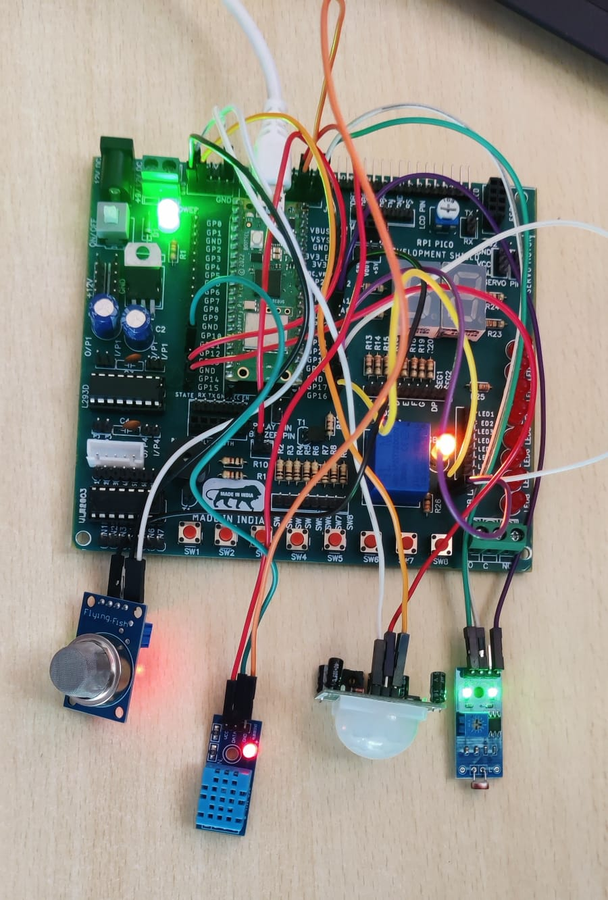
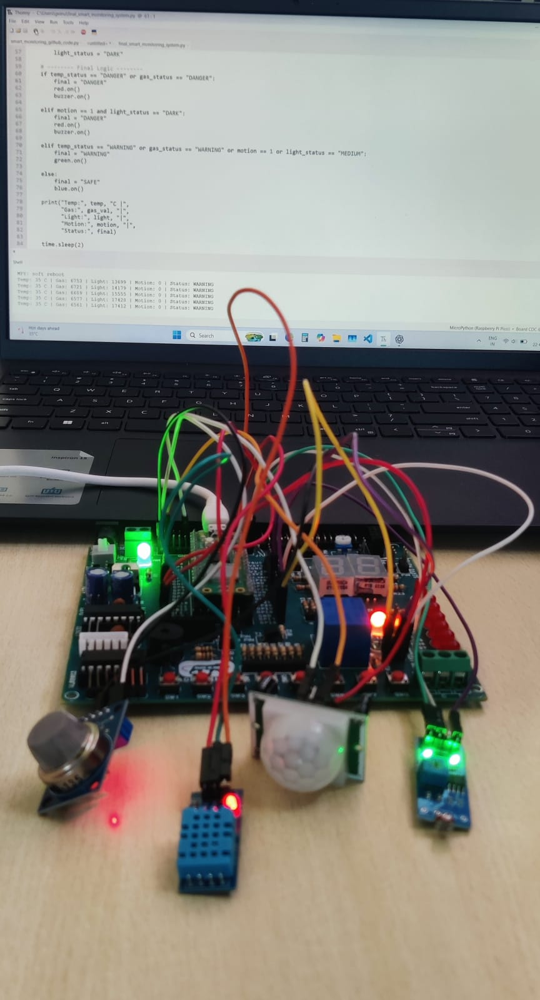
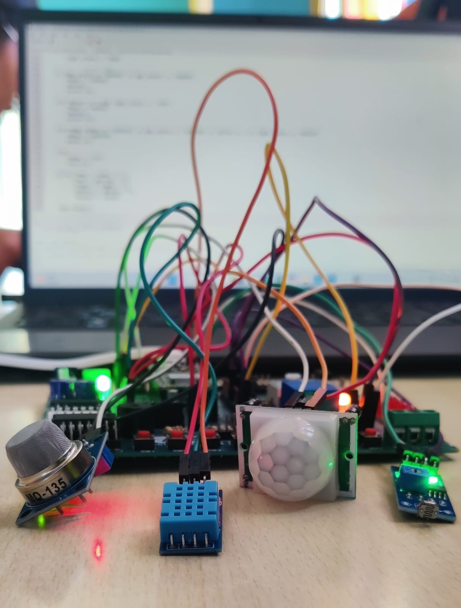
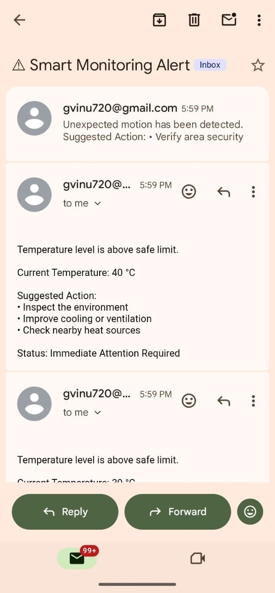

# AI-Based Smart Environment Safety Monitoring System

## Overview
A real-time IoT safety monitoring system using Raspberry Pi Pico W and multiple sensors to detect environmental risks such as gas leakage, motion detection, abnormal temperature/humidity, and low light conditions.

## Features
- Real-time sensor monitoring
- Cloud dashboard visualization
- Email alert notifications
- Risk level detection (Safe / Warning / Danger)
- Motion detection using PIR sensor
- Gas leakage detection
- Temperature and humidity monitoring

## Hardware Used
- Raspberry Pi Pico W
- MQ Gas Sensor
- PIR Motion Sensor
- DHT11 Sensor
- LDR Sensor
- Relay Module
- LEDs / Buzzer
- Jumper Wires

## Software Used
- MicroPython / Python
- Thonny IDE
- Adafruit IO Dashboard
- GitHub
- 
## Project Images

### System Overview

### Live Monitoring

### Sensor Closeup

## Dashboard

## Email Alert Notification

## Demo Video
project_demo.mp4

## Future Improvements
- Mobile App Alerts
- ML-based prediction
- Camera Integration
- Data logging

## Author
Vinushree A A
